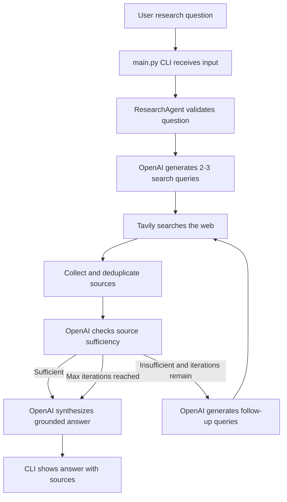

# Research Agent MVP

## Project Overview

This is a beginner-friendly Python CLI research agent that runs inside Docker.
It is designed to teach the basic building blocks of an AI agent by keeping the
code small, readable, and heavily commented.

The agent can:

- take a user research question from the terminal
- generate focused search queries with OpenAI
- search the web using Tavily
- collect and deduplicate source links
- ask OpenAI to synthesize a grounded answer from those sources
- return an answer with source links

## Architecture Overview

- `main.py`: Handles the terminal experience. It prints the welcome message,
  reads user input, supports the interactive loop, and sends questions to the
  agent.
- `agent.py`: Contains the core research workflow. It validates questions,
  generates search queries, runs web searches, deduplicates sources, checks
  whether sources are sufficient, and asks OpenAI for the final answer.
- `tools.py`: Contains external tools the agent can use. For this MVP, it wraps
  the Tavily search API and normalizes Tavily results into simple dictionaries.
- `prompts.py`: Stores prompt templates. These prompts tell OpenAI how to create
  search queries, judge source sufficiency, generate follow-up queries, and
  write the final answer.
- `config.py`: Loads environment variables from `.env`, validates required API
  keys, parses settings like `DEBUG` and `MAX_ITERATIONS`, and provides debug
  logging.
- `tests/`: Contains pytest tests. The tests use fake OpenAI and Tavily clients
  so they can run without real API calls.
- `Dockerfile`: Defines the Python container image and installs dependencies
  from `requirements.txt`.
- `docker-compose.yml`: Defines the `research-agent` service, loads `.env`, and
  mounts the project directory into the container for development.
- `.env.example`: Shows which environment variables are needed, without storing
  real secrets.
- `AGENTS.md`: Documents project goals, architecture rules, and Docker-only
  execution expectations for coding agents working on this repo.

## Research Agent Flow

Beginner version of the flow:

User Question
-> CLI receives input
-> `ResearchAgent` validates the question
-> OpenAI generates 2-3 search queries
-> Tavily searches the web
-> Sources are collected and deduplicated
-> OpenAI synthesizes the final answer
-> Answer is shown to the user with sources

The current agent can also run an iterative research loop. After collecting
sources, it asks OpenAI whether the sources are sufficient. If they are not, it
generates follow-up queries and searches again, up to `MAX_ITERATIONS`.

## Diagram



## Setup

Copy the example environment file and add your real keys:

```bash
cp .env.example .env
```

Required values:

```bash
OPENAI_API_KEY=your-openai-api-key
TAVILY_API_KEY=your-tavily-api-key
OPENAI_MODEL=gpt-5.4-mini
DEBUG=false
MAX_ITERATIONS=3
```

Build the Docker image:

```bash
docker compose build
```

## Run

Start the interactive CLI. You can ask multiple questions in one session, then
type `exit`, `quit`, or `q` to leave:

```bash
docker compose run --rm research-agent
```

Or pass a question directly:

```bash
docker compose run --rm research-agent python main.py "What are the latest trends in AI safety research?"
```

## Test

Run all tests inside Docker:

```bash
docker compose run --rm research-agent pytest
```

Do not run `pytest`, `python main.py`, or `pip install` directly on the host
machine. Dependencies are intended to live only inside the Docker image.

## Development Notes

The project directory is mounted into the container, so Python code changes do
not require rebuilding. Rebuild only when `requirements.txt`, `Dockerfile`, or
`docker-compose.yml` changes:

```bash
docker compose build
```
